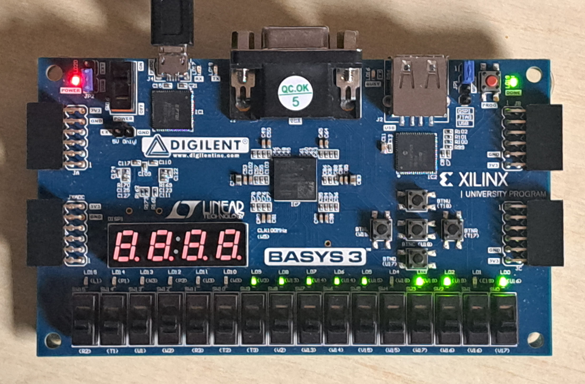
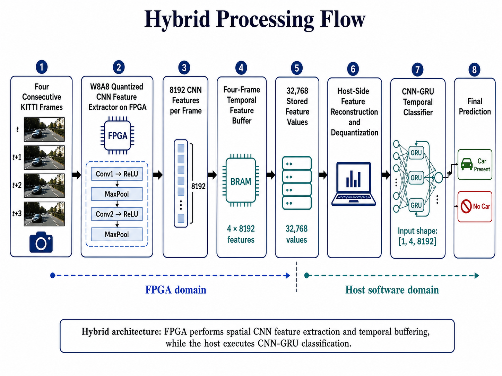
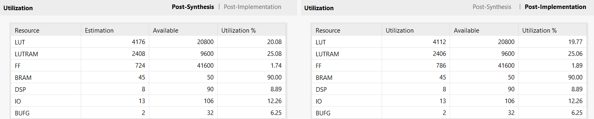
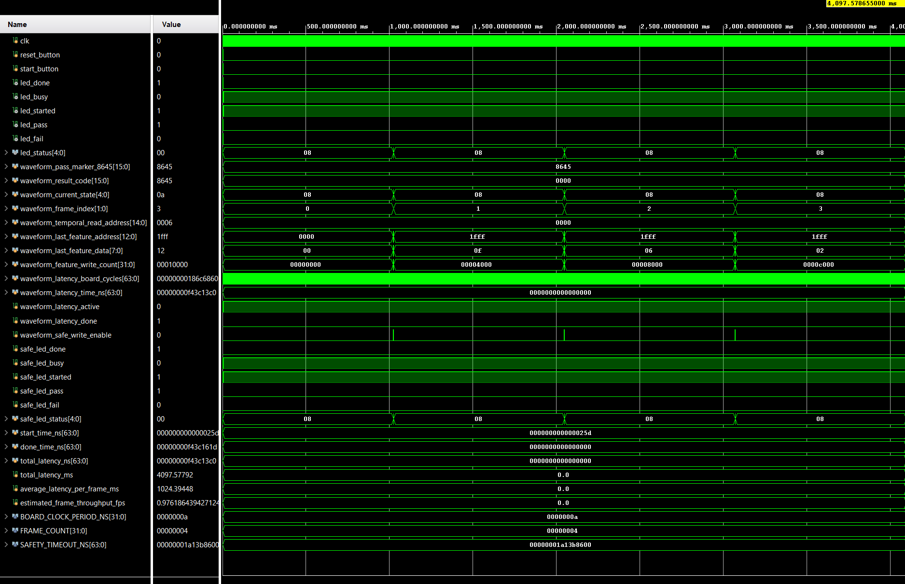

# Ongoing MSc Dissertation - Hybrid FPGA-CNN-GRU Perception for Autonomous Driving

This repository presents a public technical portfolio version of my ongoing MSc dissertation project on hardware-aware autonomous-driving perception using quantized CNN feature extraction, Verilog FPGA validation, and CNN-GRU temporal modelling.

The project investigates how a compact spatial CNN perception model can be extended into a temporal perception pipeline while remaining compatible with resource-constrained FPGA deployment. The repository contains selected source code, RTL modules, verification files, result summaries, implementation screenshots, architecture diagrams, and physical validation evidence.

Dataset files, trained checkpoints, generated feature tensors, memory-vector files, full dissertation reports, and assessment materials are intentionally excluded.

<p align="center">
  
</p>

<p align="center">
  <em>Physical Basys-3 validation of the FPGA-side hybrid CNN feature-extraction and temporal-buffering design.</em>
</p>

## Project status

This is an ongoing MSc dissertation project.

Current completed work includes:

- CNN baseline development for binary car-presence classification
- Fixed-point quantization analysis and W8A8 preparation
- FPGA-ready weight, bias, scale, and metadata export
- Verilog CNN feature extractor implementation
- Basys-3 Artix-7 FPGA implementation and verification
- CNN-RNN, CNN-LSTM, and CNN-GRU temporal model comparison
- CNN-GRU selection for hybrid validation
- Four-frame FPGA-compatible temporal feature buffering
- Host-side CNN-GRU validation using reconstructed FPGA-compatible features
- Vivado synthesis, implementation, timing, resource, and power analysis
- Physical Basys-3 validation evidence

## System overview

The project follows a hardware-aware perception flow:

1. KITTI image frames are resized to 64 × 64 RGB.
2. A compact CNN performs spatial feature extraction.
3. W8A8 fixed-point quantization is applied for FPGA-compatible inference.
4. A Verilog CNN feature extractor produces 8,192 quantized features per frame.
5. Four consecutive frames produce a 32,768-value temporal feature sequence.
6. The reconstructed temporal feature sequence is passed to a CNN-GRU classifier.
7. The final output is a binary car-present / no-car prediction.

<p align="center">
  
</p>

<p align="center">
  <em>Hybrid architecture: FPGA-side W8A8 CNN feature extraction and temporal buffering with host-side CNN-GRU classification.</em>
</p>

```text
Input image sequence
        ↓
CNN spatial feature extraction
        ↓
W8A8 fixed-point FPGA-compatible feature representation
        ↓
Four-frame temporal feature buffer
        ↓
CNN-GRU temporal classification
        ↓
Car-present / no-car prediction
```

## Architecture diagrams

The main hybrid processing flow is shown above. Additional architecture diagrams are included in `assets/architecture/` for deeper review of the FPGA-side control flow and host-side classification path.

| Diagram | Purpose |
|---|---|
| [`hybrid-architecture.png`](assets/architecture/hybrid-architecture.png) | Full hybrid FPGA-CNN-GRU processing flow |
| [`fpga-side-architecture.png`](assets/architecture/fpga-side-architecture.png) | FPGA-side bitstream architecture, temporal buffering, board controls, and output status |
| [`four-frame-control-flow.png`](assets/architecture/four-frame-control-flow.png) | Four-frame FPGA control sequence for loading, processing, and storing temporal features |
| [`host-side-classification-chain.png`](assets/architecture/host-side-classification-chain.png) | Host-side feature reconstruction, dequantization, tensor reshaping, and CNN-GRU classification |

## Key technical contributions

- Developed a compact CNN baseline for binary car-presence classification.
- Evaluated quantization robustness and selected W8A8 fixed-point representation.
- Exported FPGA-ready weights, corrected biases, activation scales, and metadata.
- Implemented Conv1, ReLU, MaxPool, Conv2, ReLU, and MaxPool feature extraction in Verilog HDL.
- Verified 8,192 CNN feature outputs against Python-generated golden references.
- Built and evaluated CNN-RNN, CNN-LSTM, and CNN-GRU temporal models using four-frame CNN feature sequences.
- Selected CNN-GRU for hybrid validation based on recall, F1-score, false-negative reduction, and model-complexity trade-off.
- Implemented four-frame temporal feature capture with 32,768 signed 8-bit feature values.
- Validated hybrid FPGA-compatible feature reconstruction with host-side CNN-GRU inference.
- Completed Vivado synthesis, implementation, timing, resource, and power analysis for the FPGA-side design.

## Results summary

| Area | Result |
|---|---:|
| CNN input size | 64 × 64 RGB |
| CNN feature size | 8,192 features per frame |
| CNN parameters | 1,054,050 |
| Selected quantization | W8A8 |
| Temporal sequence length | 4 frames |
| Temporal feature shape | 4 × 8,192 |
| FPGA-compatible temporal feature values | 32,768 |
| Temporal models evaluated | CNN-RNN, CNN-LSTM, CNN-GRU |
| Selected temporal model | CNN-GRU |
| CNN-GRU test accuracy | 99.07% |
| CNN-GRU recall | 99.85% |
| CNN-GRU F1-score | 99.49% |
| Hybrid full-test prediction preservation | 750 / 750 |

A more detailed result breakdown is provided in [`docs/results-summary.md`](docs/results-summary.md).

## CNN baseline and quantization

The CNN baseline uses a compact convolutional architecture for binary car-presence classification.

The CNN feature-extraction path is:

```text
Input image
→ Conv1
→ ReLU
→ MaxPool
→ Conv2
→ ReLU
→ MaxPool
→ 8,192-feature output vector
```

The full CNN also includes fully connected classification layers for the baseline software model. For the FPGA/hybrid pipeline, the feature output before the classifier is used as the hardware-compatible representation.

W8A8 quantization was selected because it provides an FPGA-friendly fixed-point representation while preserving the accuracy of the compact CNN model. The quantization workflow includes activation-scale calibration, corrected-bias export, fixed-point metadata generation, and Python golden-vector preparation for RTL verification.

## FPGA implementation

The FPGA-side design targets the Digilent Basys-3 board with an Artix-7 FPGA.

The implemented hardware path focuses on quantized CNN feature extraction:

```text
Input image
→ Conv1
→ ReLU
→ MaxPool
→ Conv2
→ ReLU
→ MaxPool
→ 8,192 quantized output features
```

The design was implemented in Verilog HDL and verified using Python-generated fixed-point references. The FPGA-side architecture does not implement the full CNN classifier layers or the full CNN-GRU recurrent classifier in hardware.

<p align="center">
  
</p>

<p align="center">
  <em>Vivado resource-utilisation evidence for the FPGA-side hybrid design.</em>
</p>

## Hybrid FPGA-CNN-GRU validation

The hybrid architecture uses the FPGA-side CNN feature extractor as the spatial feature-generation block. Four consecutive frames are processed to create a temporal feature sequence.

```text
4 frames × 8,192 features = 32,768 signed 8-bit feature values
```

The temporal feature buffer stores the four generated feature vectors in order:

| Frame | Feature index range | Buffer address range |
|---|---:|---:|
| Frame 0 | 0 to 8,191 | 0 to 8,191 |
| Frame 1 | 0 to 8,191 | 8,192 to 16,383 |
| Frame 2 | 0 to 8,191 | 16,384 to 24,575 |
| Frame 3 | 0 to 8,191 | 24,576 to 32,767 |

<p align="center">
  
</p>

<p align="center">
  <em>RTL verification evidence for four-frame temporal feature capture and buffering.</em>
</p>

The stored feature sequence is reconstructed on the host side and passed to the trained CNN-GRU temporal classifier.

This validates a hybrid architecture where:

- the FPGA performs quantized CNN feature extraction and temporal buffering;
- the host-side CNN-GRU performs temporal classification.

## Temporal model selection

Three temporal models were compared using the same four-frame CNN feature representation:

| Model | Parameters | Test accuracy | Recall | F1-score |
|---|---:|---:|---:|---:|
| CNN-RNN | 1,065,474 | 98.40% | 99.41% | 99.12% |
| CNN-LSTM | 4,261,122 | 99.07% | 99.56% | 99.49% |
| CNN-GRU | 3,195,906 | 99.07% | 99.85% | 99.49% |

CNN-GRU was selected because it matched CNN-LSTM test accuracy and F1-score while using fewer parameters. It also achieved the highest recall and the lowest false-negative count, which is important for car-presence perception.

A fuller comparison is provided in [`docs/temporal-model-comparison.md`](docs/temporal-model-comparison.md).

## Repository structure

```text
hybrid-fpga-cnn-gru-autonomous-driving/
├── README.md
├── .gitignore
├── python/
│   ├── cnn_baseline/
│   ├── fixed_point_quantization/
│   └── hybrid_validation/
├── verilog/
│   ├── rtl/
│   ├── testbenches/
│   └── constraints/
├── docs/
└── assets/
    ├── architecture/
    ├── vivado_results/
    └── hardware_validation/
```

## Python components

### `python/cnn_baseline`

Contains selected Python files for the CNN baseline, dataset loading, profiling, and baseline result summary.

### `python/fixed_point_quantization`

Contains selected Python files and metadata for quantization evaluation, activation-scale calibration, corrected-bias export, and FPGA-compatible fixed-point preparation.

### `python/hybrid_validation`

Contains selected Python files for FPGA-compatible feature reconstruction, quantization consistency checking, and CNN-GRU hybrid validation.

## Verilog components

### `verilog/rtl`

Contains synthesizable Verilog HDL modules for the quantized CNN feature extractor and temporal feature-buffering logic.

### `verilog/testbenches`

Contains verification testbenches for CNN feature extraction, temporal capture, and supporting hardware modules.

### `verilog/constraints`

Contains Basys-3 XDC constraints for the FPGA-side implementation.

## Evidence included

The repository includes selected visual evidence only:

- Architecture and processing-flow diagrams
- Vivado elaborated-design screenshots
- RTL simulation screenshots
- Console verification screenshots
- Timing-analysis screenshots
- Resource-utilisation screenshots
- Power-analysis screenshots
- Synthesis and implementation screenshots
- Basys-3 physical validation photos

## Dataset note

This project uses the KITTI dataset for autonomous-driving perception experiments. The dataset is not redistributed in this repository.

Users must obtain the dataset from the official KITTI source and follow the relevant licensing and usage conditions:

https://www.cvlibs.net/datasets/kitti/

Further details are provided in [`docs/dataset-and-artifact-notes.md`](docs/dataset-and-artifact-notes.md).

## Excluded files

The following files are intentionally excluded from this public repository:

- Raw datasets
- KITTI images and labels
- Dataset archives
- Trained model checkpoints
- `.pt`, `.pth`, `.pkl`, and similar model files
- Generated feature tensors
- Generated `.mem` input and expected-output files
- Vivado checkpoints
- Vivado generated project folders
- Bitstreams
- Full dissertation reports
- Supervisor feedback
- Large ZIP archives

## Tools and technologies

- Python
- PyTorch
- NumPy
- Verilog HDL
- Xilinx Vivado
- Digilent Basys-3 FPGA board
- Artix-7 FPGA
- Fixed-point quantization
- CNN feature extraction
- CNN-GRU temporal modelling

## Academic note

This repository is a public technical portfolio version of an ongoing MSc dissertation project. It is not a full dissertation submission package.

The repository is intended to demonstrate technical implementation, hardware-aware machine-learning workflow, RTL validation, and FPGA deployment evidence while keeping datasets, generated artifacts, and assessment materials private.
