# Hybrid FPGA-CNN-GRU Perception for Autonomous Driving

This repository presents a public technical portfolio version of my ongoing MSc dissertation project on hardware-aware autonomous-driving perception using quantized CNN feature extraction, Verilog FPGA implementation, temporal feature buffering, FPGA-native streaming/dataflow acceleration, and CNN-GRU temporal modelling.

The project investigates how a compact spatial CNN can be extended into a temporal perception pipeline while remaining compatible with FPGA deployment. Development has progressed from software CNN validation and W8A8 quantisation through Basys-3 implementation, Nexys Video scalability analysis, scheduled RTL optimisation, and finally an FPGA-native streaming/dataflow redesign.

The final FPGA architecture reduces four-frame CNN feature-extraction latency from **4097.577920 ms to 11.577460 ms** at the same **50 MHz CNN core clock**.

Key final results:

- **11.577460 ms** four-frame latency
- **2.894365 ms** average latency per frame
- **345.498926 fps** effective throughput
- **19.623095×** speedup over the preceding four-lane architecture
- **94.903964%** latency reduction over the preceding architecture
- approximately **353.93×** total speedup over the original FPGA implementation
- approximately **99.717%** total latency reduction
- **32,768 / 32,768** expected W8A8 temporal features matched
- **0 numerical mismatches**
- successful synthesis, placement, routing, timing closure, and bitstream generation
- successful physical Nexys Video execution

> **Measurement note:** FPGA latency values reported in this repository are derived from board-level RTL simulation. Physical FPGA deployment has also been demonstrated, including execution of the final streaming architecture on the Nexys Video, but the detailed latency figures are not direct oscilloscope, ILA, UART, or external hardware-counter measurements.

---

## FPGA Platforms

The project has been implemented and evaluated using two Xilinx Artix-7 FPGA platforms:

| Platform | FPGA | Role |
|---|---|---|
| Digilent Basys-3 | XC7A35T | Original FPGA implementation, constrained-device validation, and earlier architectural optimisation |
| Digilent Nexys Video | XC7A200T | Device-scalability analysis and final FPGA-native streaming/dataflow implementation |

<p align="center">
  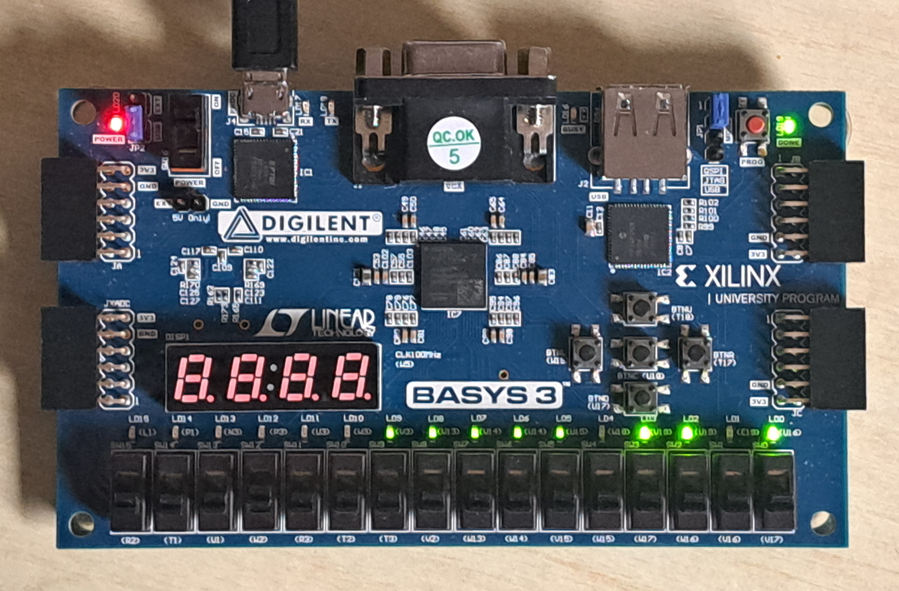
  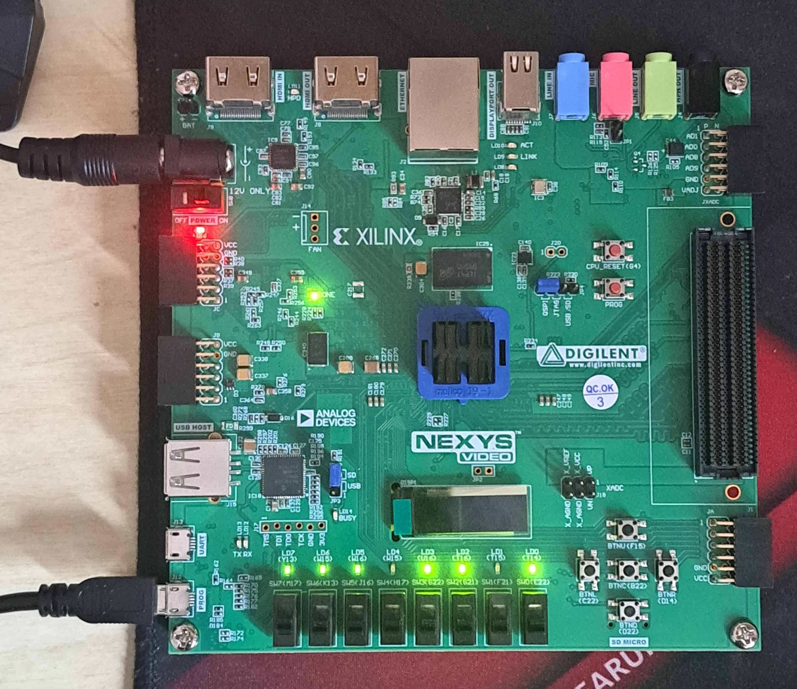
</p>

<p align="center">
  <em>Physical FPGA validation evidence from the Basys-3 and Nexys Video implementation stages.</em>
</p>

---

## Project Status

This is an ongoing MSc dissertation project.

Completed work currently includes:

- compact CNN baseline development for binary car-presence classification
- fixed-point quantisation analysis and W8A8 selection
- FPGA-ready CNN parameter and fixed-point export
- Verilog CNN feature-extractor implementation
- exact Python-to-RTL feature verification
- four-frame temporal feature buffering
- CNN-RNN, CNN-LSTM, and CNN-GRU temporal-model comparison
- CNN-GRU selection for hybrid temporal classification
- host-side CNN-GRU validation using FPGA-compatible reconstructed features
- Basys-3 Artix-7 FPGA implementation
- physical Basys-3 validation
- controlled Basys-3 to Nexys Video FPGA port
- Nexys Video implementation and physical validation
- FPGA device-resource scalability analysis
- detailed latency bottleneck analysis
- pipelined Conv2 MAC optimisation
- four-output-channel Conv2 parallelisation
- banked Conv2 parameter memory
- four-output-channel Conv1 parallelisation
- exact 32,768-feature optimized RTL regression
- FPGA-native streaming/dataflow redesign
- multichannel streaming 3 × 3 window generation
- spatial window-set replay buffering
- four-lane streaming convolution
- parameter banking
- shared pipelined requantisation
- ready/valid backpressure handling
- streaming 2 × 2 MaxPool
- streaming SAME-padding
- final feature reordering
- exact 32,768-feature streaming RTL regression
- final Nexys Video synthesis and implementation
- post-route resource, timing, and power analysis
- final bitstream generation
- physical Nexys Video execution of the streaming implementation

---

# System Overview

The hybrid perception architecture combines FPGA-side spatial feature extraction with host-side temporal classification.

<p align="center">
  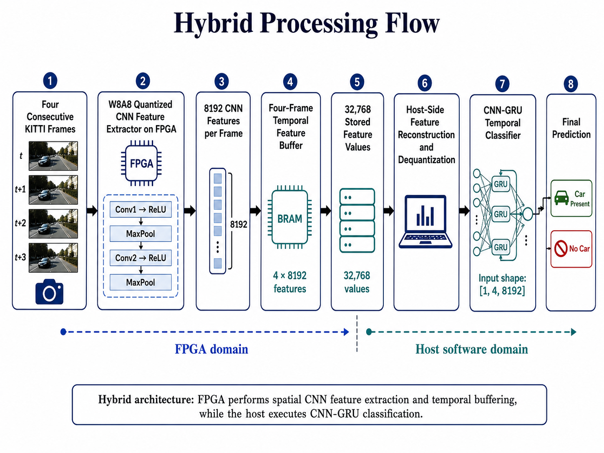
</p>

<p align="center">
  <em>Hybrid architecture combining FPGA-side W8A8 CNN feature extraction and temporal buffering with host-side CNN-GRU classification.</em>
</p>

```text
Four consecutive 64 × 64 RGB frames
                |
                v
         W8A8 CNN on FPGA
                |
        Conv1 -> ReLU -> MaxPool
                |
        Conv2 -> ReLU -> MaxPool
                |
                v
        8,192 features/frame
                |
                v
      Four-frame temporal buffer
                |
                v
   32,768 signed 8-bit features
                |
                v
       Host-side reconstruction
                |
                v
          CNN-GRU classifier
                |
                v
        Car-present / no-car
```

The FPGA implementation currently covers the quantized CNN feature-extraction and temporal-buffering portion of the system.

The complete CNN-GRU recurrent classifier is not currently implemented entirely in FPGA programmable logic.

---

## Architecture Diagrams

Additional architecture diagrams are available in `assets/architecture/`.

| Diagram | Purpose |
|---|---|
| [`hybrid-architecture.png`](assets/architecture/hybrid-architecture.png) | Complete hybrid FPGA-CNN-GRU processing flow |
| [`fpga-side-architecture.png`](assets/architecture/fpga-side-architecture.png) | Earlier FPGA-side CNN feature-extraction and temporal-buffer architecture |
| [`four-frame-control-flow.png`](assets/architecture/four-frame-control-flow.png) | Earlier four-frame scheduled FPGA processing sequence |
| [`host-side-classification-chain.png`](assets/architecture/host-side-classification-chain.png) | Host-side reconstruction, tensor preparation, and CNN-GRU classification |

---

# Headline Results

## Machine-Learning Results

| Result | Value |
|---|---:|
| CNN input | 64 × 64 RGB |
| CNN parameters | 1,054,050 |
| Selected quantisation | W8A8 |
| CNN features per frame | 8,192 |
| Temporal sequence | 4 frames |
| Temporal feature values | 32,768 |
| CNN-GRU test accuracy | 99.07% |
| CNN-GRU recall | 99.85% |
| CNN-GRU F1-score | 99.49% |
| CNN-GRU false negatives | 1 |
| Hybrid prediction preservation | 750 / 750 |

## Final FPGA Results

| Metric | Result |
|---|---:|
| Original four-frame latency | 4097.577920 ms |
| Previous optimized four-frame latency | 227.185600 ms |
| **Final streaming four-frame latency** | **11.577460 ms** |
| Final average latency/frame | **2.894365 ms** |
| Final throughput | **345.498926 fps** |
| Speedup vs previous architecture | **19.623095×** |
| Latency reduction vs previous architecture | **94.903964%** |
| Total speedup vs original | **353.93×** |
| Total latency reduction vs original | **99.717%** |
| CNN core clock | **50 MHz** |
| Temporal features verified | **32,768** |
| Feature mismatches | **0** |
| Final regression | **PASS** |

The final performance improvement was achieved **without increasing the controlled 50 MHz CNN core frequency**.

The acceleration therefore comes primarily from architectural changes including streaming data movement, spatial reuse, four-lane convolution processing, parameter banking, pipelining, ready/valid flow control, and reduced controller-driven serialization.

Detailed results:

[`docs/results-summary.md`](docs/results-summary.md)

---

# CNN Baseline and Quantisation

The software CNN baseline uses the following feature-extraction path:

```text
64 × 64 RGB input
        |
        v
      Conv1
        |
       ReLU
        |
      MaxPool
        |
      Conv2
        |
       ReLU
        |
      MaxPool
        |
        v
32 × 16 × 16
        |
        v
8,192 features
```

The full software CNN also contains fully connected classification layers.

For FPGA and hybrid processing, the 8,192-feature convolutional representation before those classifier layers is used.

W8A8 quantisation was selected as the FPGA implementation format.

The fixed-point workflow includes:

- activation-scale calibration
- signed 8-bit weight representation
- corrected integer bias export
- fixed-point requantisation metadata
- Python-generated reference vectors
- RTL feature-by-feature comparison

---

# Temporal Model Evaluation

Three recurrent temporal architectures were evaluated using identical four-frame CNN feature sequences.

| Model | Parameters | Test Accuracy | Recall | F1-score |
|---|---:|---:|---:|---:|
| CNN-RNN | 1,065,474 | 98.40% | 99.41% | 99.12% |
| CNN-LSTM | 4,261,122 | 99.07% | 99.56% | 99.49% |
| CNN-GRU | 3,195,906 | **99.07%** | **99.85%** | **99.49%** |

CNN-GRU was selected because it matched CNN-LSTM test accuracy and F1-score while:

- using fewer parameters
- achieving the highest recall
- producing the lowest false-negative count

Detailed comparison:

[`docs/temporal-model-comparison.md`](docs/temporal-model-comparison.md)

---

# Four-Frame FPGA Temporal Feature Extraction

Each frame produces:

```text
8,192 signed 8-bit features
```

Four consecutive frames therefore produce:

```text
4 × 8,192 = 32,768 signed 8-bit temporal feature values
```

The temporal buffer uses the following address organisation:

| Frame | Buffer Address Range |
|---|---:|
| Frame 0 | 0 to 8,191 |
| Frame 1 | 8,192 to 16,383 |
| Frame 2 | 16,384 to 24,575 |
| Frame 3 | 24,576 to 32,767 |

The final streaming implementation preserves this established temporal feature interface.

---

# FPGA Device Scalability

The validated temporal feature-extraction architecture was transferred from the Basys-3 to the substantially larger Nexys Video FPGA **without changing the architecture or the 50 MHz CNN core clock**.

This controlled experiment separated FPGA capacity from FPGA architecture.

## Resource Scalability of the Unchanged Architecture

| Resource | Basys-3 | Nexys Video |
|---|---:|---:|
| Slice LUTs | 19.77% | 3.06% |
| Slice Registers | 1.89% | 0.27% |
| Block RAM | 90.00% | 12.33% |
| DSP48E1 | 8.89% | 1.08% |

The Nexys Video substantially increased implementation headroom, particularly for block RAM.

However, the unchanged architecture retained identical latency:

| Metric | Basys-3 | Nexys Video |
|---|---:|---:|
| Four-frame latency | 4097.577920 ms | 4097.577920 ms |
| Average latency/frame | 1024.394480 ms | 1024.394480 ms |
| Throughput | 0.976186 fps | 0.976186 fps |

Therefore:

```text
Larger FPGA capacity alone
            !=
Lower architectural latency
```

The additional resources had to be actively exploited through architectural redesign.

Full details:

[`docs/fpga-device-scalability.md`](docs/fpga-device-scalability.md)

---

# FPGA Bottleneck Analysis

Cycle-level analysis identified Conv2 as the dominant component of the original architecture.

```text
Conv2 cycles/frame ≈ 47,028,224
Conv2 latency       ≈ 940.564480 ms/frame
Share of latency    ≈ 91.82%
```

The original controller performed memory access, operand preparation, multiplication, accumulation, and output processing using a highly serial execution schedule.

The dominant limitation was therefore the execution strategy rather than insufficient FPGA capacity.

This finding motivated the subsequent FPGA-oriented architectural optimisations.

---

# Scheduled FPGA Architecture Optimisation

The first major optimisation phase redesigned the existing scheduled RTL incrementally.

## Performance Progression

| Architecture | Four-Frame Latency | Average per Frame | Throughput | Speedup vs Original |
|---|---:|---:|---:|---:|
| Original architecture | 4097.577920 ms | 1024.394480 ms | 0.976186 fps | 1.00× |
| Pipelined Conv2 MAC | 752.128960 ms | 188.032240 ms | 5.318237 fps | 5.45× |
| Four-lane Conv2 | 449.352640 ms | 112.338160 ms | 8.901695 fps | 9.12× |
| Four-lane Conv1 + Conv2 | **227.185600 ms** | **56.796400 ms** | **17.606750 fps** | **18.04×** |

```text
Original serial architecture
        4097.577920 ms
               |
               v
       Pipelined Conv2
         752.128960 ms
               |
               v
       Four-lane Conv2
         449.352640 ms
               |
               v
   Four-lane Conv1 + Conv2
         227.185600 ms
               |
               v
        18.04× speedup
```

Detailed analysis:

[`docs/fpga-architecture-optimisation.md`](docs/fpga-architecture-optimisation.md)

---

## Pipelined Conv2

The first optimisation reorganised the Conv2 MAC schedule around registered arithmetic.

The objective was to reduce state-machine overhead while preserving the established W8A8 numerical computation.

This reduced four-frame latency from:

```text
4097.577920 ms
```

to:

```text
752.128960 ms
```

for a **5.45× speedup**.

---

## Four-Lane Conv2

The next architecture processed four independent Conv2 output channels concurrently.

The design introduced:

- four W8A8 multiplication lanes
- four independent accumulators
- four Conv2 weight banks
- four bias banks
- shared input-feature access

The bank mapping follows:

```text
Bank = Output Channel mod 4
```

Four-frame latency decreased to:

```text
449.352640 ms
```

corresponding to a **9.12× speedup** over the original architecture.

---

## Four-Lane Conv1

After Conv2 acceleration, Conv1 became the principal remaining processing component.

Two-, four-, and eight-lane Conv1 configurations were analysed.

| Conv1 Parallelism | Predicted Four-Frame Latency | Predicted Throughput |
|---|---:|---:|
| 2 lanes | 301.241280 ms | 13.278393 fps |
| 4 lanes | 227.185600 ms | 17.606750 fps |
| 8 lanes | 190.157760 ms | 21.035166 fps |

Four lanes were selected as the design-space knee because the eight-lane configuration offered a smaller whole-system improvement while increasing DSP demand, routing pressure, fan-out, parameter-bank connectivity, and verification complexity.

The resulting architecture achieved:

```text
227.185600 ms / four frames
56.796400 ms / frame
17.606750 fps
18.04× speedup
```

at the same 50 MHz CNN core clock.

---

# FPGA-Native Streaming/Dataflow Redesign

The final optimisation phase moves beyond the preceding layer-by-layer scheduled architecture.

The final processing structure is:

```text
Padded RGB input stream
        |
        v
Multichannel streaming 3 × 3 window generation
        |
        v
Spatial window-set replay buffering
        |
        v
Four-lane convolution
        |
        v
Channel accumulation
        |
        v
Shared pipelined requantisation
        |
        v
ReLU
        |
        v
Streaming 2 × 2 MaxPool
        |
        v
Streaming SAME-padding
        |
        v
Four-lane Conv2
        |
        v
ReLU
        |
        v
Streaming 2 × 2 MaxPool
        |
        v
Raw CNN feature stream
        |
        v
Feature reorder buffer
        |
        v
8,192-value channel-major feature vector
        |
        v
Four-frame temporal BRAM
        |
        v
32,768 temporal features
```

The architecture uses ready/valid handshaking between major stages so downstream backpressure can stall upstream processing without corrupting feature ordering.

Detailed documentation:

[`docs/fpga-streaming-dataflow.md`](docs/fpga-streaming-dataflow.md)

---

## Streaming Window Generation and Spatial Replay

The input stream is converted into 3 × 3 spatial windows using dedicated streaming logic.

Spatial window sets are retained and replayed across groups of output channels rather than reconstructing the same neighbourhood independently for each group.

Relevant RTL includes:

```text
streaming_spatial_frontend.v
streaming_multichannel_3x3_window_generator.v
streaming_3x3_window_generator.v
spatial_window_set_replay_buffer.v
```

This reduces unnecessary data movement and enables greater processing overlap.

---

## Four-Lane Streaming Convolution

The principal convolution datapath processes four output channels concurrently.

Each lane evaluates a complete 3 × 3 kernel using nine multiplication operations.

Therefore:

```text
4 lanes × 9 multiplications
=
36 kernel multiplications
```

can be active during four-lane convolution processing.

Relevant RTL includes:

```text
convolution_four_lane_datapath.v
conv3x3_four_lane_channel_engine.v
conv3x3_four_lane_parallel.v
conv3x3_parallel_dot_product.v
conv_four_lane_channel_accumulator.v
convolution_group_cadence_controller.v
```

---

## Parameter Banking and Requantisation

The final architecture uses parallel parameter access and shared pipelined requantisation.

Relevant modules include:

```text
streaming_convolution_parameter_bank.v
four_lane_requantize_pipeline.v
four_lane_requantize_dispatcher.v
requantize_relu_pipeline.v
```

The streaming redesign changes the FPGA execution architecture while preserving the validated W8A8 numerical behaviour.

---

## Streaming MaxPool and SAME Padding

Relevant modules include:

```text
streaming_maxpool_2x2.v
streaming_same_padding_adapter.v
streaming_convolution_maxpool_layer.v
streaming_conv2_maxpool_layer.v
streaming_conv2_layer.v
```

These stages enable greater overlap between Conv1 output generation, pooling, padding, and Conv2 processing.

---

## Feature Reordering

The natural feature ordering produced by the streaming CNN differs from the established channel-major temporal representation.

The final architecture therefore includes:

```text
streaming_feature_reorder_buffer.v
```

For the final 32 × 16 × 16 output tensor:

```text
feature_address =
    output_channel × 256
    + y × 16
    + x
```

This restores the established 8,192-value feature ordering before temporal buffering.

---

# Exact Streaming RTL Verification

Exact numerical equivalence remained a mandatory architectural requirement.

The final four-frame regression produced:

| Verification Metric | Result |
|---|---:|
| Frames processed | 4 |
| Accepted padded inputs | 52,272 |
| Raw final-CNN features | 32,768 |
| Reordered temporal features | 32,768 |
| Expected-vector comparisons | **32,768** |
| Expected-vector mismatches | **0** |
| Duplicate reordered addresses | 0 |
| Missing reordered addresses | 0 |
| Address/frame-index errors | 0 |
| Feature X/Z errors | 0 |
| Frame completion pulses | 4 |
| Temporal frames captured | 4 |
| `temporal_capture_complete` | 1 |
| Final regression | **PASS** |

<p align="center">
  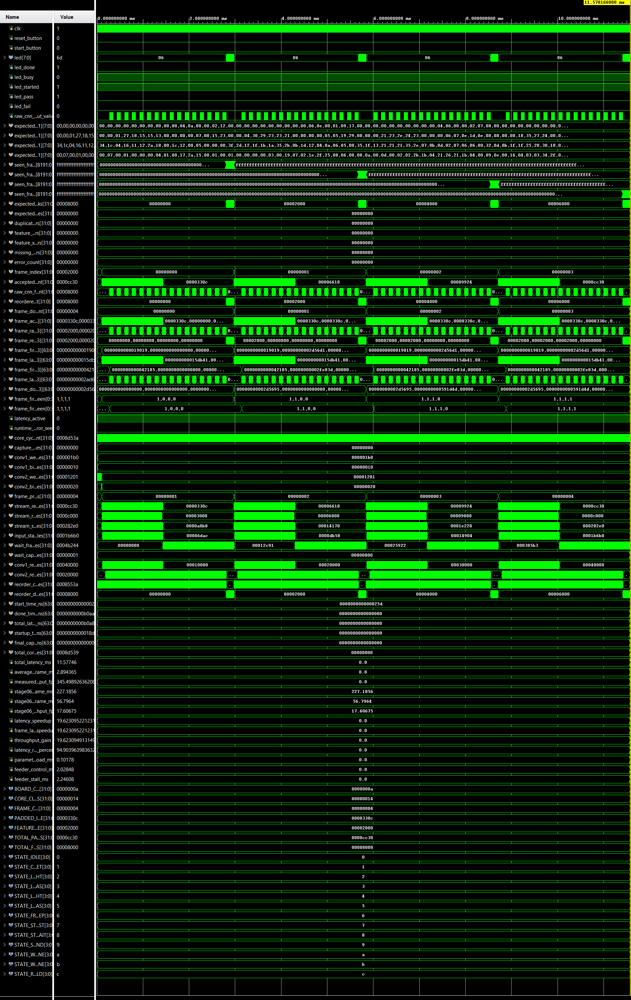
</p>

<p align="center">
  <em>Final board-wrapper RTL regression covering four-frame streaming execution, temporal capture, latency measurement, and expected-vector verification.</em>
</p>

The final streaming implementation therefore reproduces:

```text
32,768 / 32,768 expected features
0 numerical mismatches
```

---

# Final Streaming Latency

The final board-wrapper regression operates with:

```text
External board clock = 100 MHz
CNN core clock       = 50 MHz
```

Final result:

| Metric | Result |
|---|---:|
| Four-frame execution cycles | 578,873 |
| Four-frame latency | **11.577460 ms** |
| Average latency/frame | **2.894365 ms** |
| Effective throughput | **345.498926 fps** |
| CNN core clock | **50 MHz** |

Relative to the preceding architecture:

```text
227.185600 ms
      |
      v
11.577460 ms
```

This represents:

```text
19.623095× speedup
94.903964% latency reduction
```

Relative to the original architecture:

```text
4097.577920 ms
      |
      v
11.577460 ms
```

This represents approximately:

```text
353.93× total speedup
99.717% total latency reduction
```

The CNN core clock remains fixed at 50 MHz.

The reported latency values are **board-level RTL simulation measurements**, not direct physical hardware timing measurements.

---

## Per-Frame Streaming Behaviour

| Measurement | Result |
|---|---:|
| First accepted input to first raw CNN output | 0.168300 ms |
| First accepted input to final raw CNN output | 2.705000 ms |
| Final raw output to reordered frame completion | 0.163860 ms |
| First accepted input to frame completion | 2.868860 ms |

The complete four-frame average is slightly larger because it also includes parameter-loading and board-wrapper overhead.

---

# Final Nexys Video Resource Utilisation

The final architecture was synthesised, placed, and routed for:

```text
Digilent Nexys Video
Xilinx Artix-7 XC7A200T
xc7a200tsbg484-1
Vivado 2025.1
```

Post-implementation utilisation:

| Resource | Used | Available | Utilisation |
|---|---:|---:|---:|
| Slice LUTs | 11,194 | 133,800 | **8.37%** |
| LUTs as logic | 5,672 | 133,800 | 4.24% |
| LUTs as memory | 5,522 | - | - |
| Distributed RAM LUTs | 5,400 | - | - |
| Slice Registers | 6,223 | 267,600 | **2.33%** |
| Block RAM | 28.5 | 365 | **7.81%** |
| DSP48E1 | 104 | 740 | **14.05%** |
| BUFGCTRL | 2 | 32 | **6.25%** |

<p align="center">
  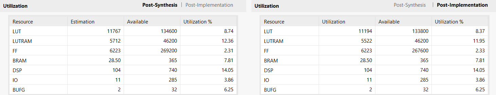
</p>

The final architecture retains substantial resource headroom despite the increased streaming concurrency.

---

# Final Nexys Video Routed Timing

| Timing Metric | Result |
|---|---:|
| CNN core period | 20.000 ns |
| CNN core frequency | 50 MHz |
| WNS | **+0.680 ns** |
| TNS | 0.000 ns |
| WHS | **+0.047 ns** |
| THS | 0.000 ns |
| Setup failing endpoints | 0 |
| Hold failing endpoints | 0 |
| Routable nets | 19,109 |
| Fully routed nets | 19,109 |
| Routing errors | 0 |

<p align="center">
  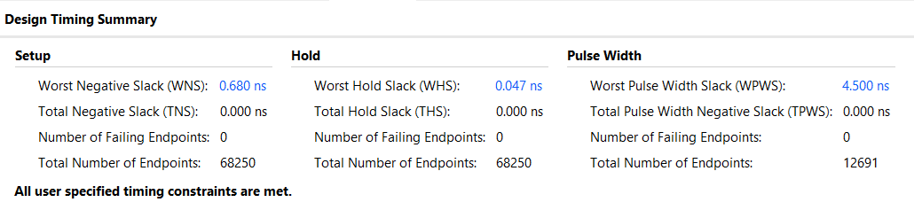
</p>

The final architecture successfully closes timing and routing at the required 50 MHz CNN core clock.

---

# Final Power Estimate

Vivado 2025.1 post-route vectorless power analysis produced:

| Metric | Result |
|---|---:|
| Total on-chip power | **0.213 W** |
| Dynamic power | 0.077 W |
| Device static power | 0.136 W |
| Estimated junction temperature | 25.7 °C |
| Confidence | Medium |

These figures are Vivado implementation estimates rather than direct physical board-power measurements.

---

# Final Physical Nexys Video Validation

The final streaming bitstream was programmed onto the physical Digilent Nexys Video.

The board-level implementation provides status outputs for:

- Done
- Busy
- Started
- Pass
- Fail
- `temporal_capture_complete`
- captured frame-count status
- feature-data parity/debug status

<p align="center">
  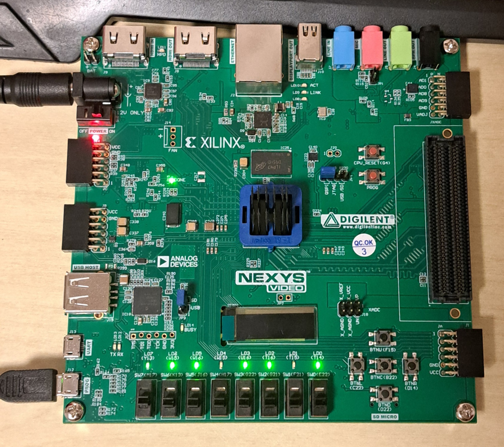
</p>

<p align="center">
  <em>Physical execution of the final FPGA-native streaming CNN architecture on the Nexys Video.</em>
</p>

The implemented design reached the expected completed PASS state with temporal capture complete.

The physical board validation demonstrates successful execution of the routed bitstream and board-level completion logic.

The LED outputs do not independently inspect all 32,768 internal temporal feature values. Exact numerical equivalence is established by the self-checking RTL regression.

---

# Historical Optimized RTL Verification

Before the final streaming redesign, the preceding four-lane scheduled architecture was also verified against the complete four-frame reference sequence.

| Verification Metric | Result |
|---|---:|
| Temporal frames captured | 4 |
| CNN features streamed | 32,768 |
| Stream address errors | 0 |
| Stream X/Z values | 0 |
| Stream mismatches | 0 |
| Temporal-buffer X/Z values | 0 |
| Temporal-buffer mismatches | 0 |
| Final regression | **PASS** |

<p align="center">
  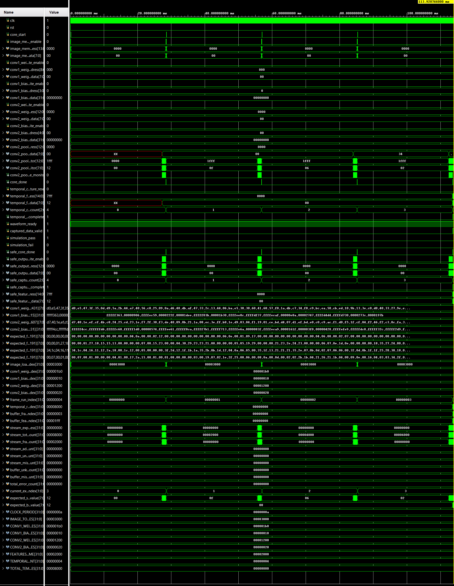
</p>

<p align="center">
  <em>Earlier four-frame RTL regression for the optimized scheduled architecture.</em>
</p>

This historical result demonstrates that exact numerical equivalence was preserved throughout the incremental optimisation process.

---

# Historical Optimized FPGA Resource Utilisation

The preceding four-lane architecture was implemented on both FPGA targets.

| Resource | Basys-3 XC7A35T | Nexys Video XC7A200T |
|---|---:|---:|
| Slice LUTs | 4,876 / 20,800 = 23.44% | 4,859 / 133,800 = 3.63% |
| Slice Registers | 1,206 / 41,600 = 2.90% | 1,206 / 267,600 = 0.45% |
| Block RAM | 44.5 / 50 = 89.00% | 44.5 / 365 = 12.19% |
| DSP48E1 | 16 / 90 = 17.78% | 16 / 740 = 2.16% |

<p align="center">
  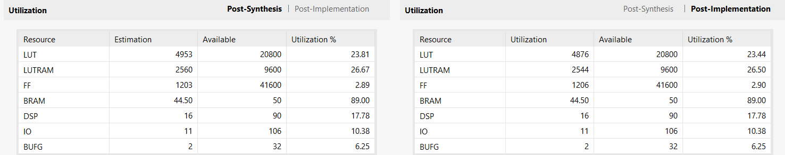
  
</p>

<p align="center">
  <em>Resource utilisation of the preceding four-lane optimized architecture on Basys-3 and Nexys Video.</em>
</p>

---

# Historical Optimized Routed Timing

| Timing Metric | Basys-3 | Nexys Video |
|---|---:|---:|
| CNN core period | 20.000 ns | 20.000 ns |
| CNN core frequency | 50 MHz | 50 MHz |
| WNS | +3.599 ns | +4.347 ns |
| TNS | 0.000 ns | 0.000 ns |
| WHS | +0.034 ns | +0.124 ns |
| THS | 0.000 ns | 0.000 ns |
| Setup failing endpoints | 0 | 0 |
| Hold failing endpoints | 0 | 0 |

<p align="center">
  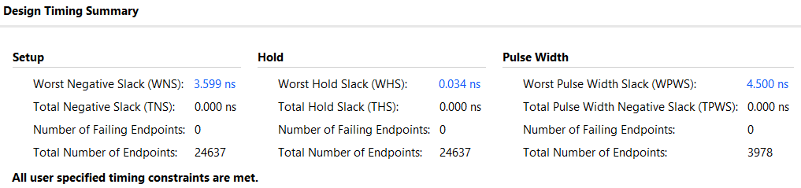
  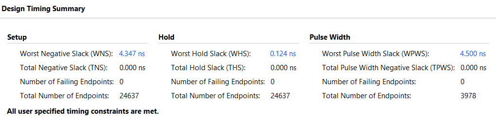
</p>

<p align="center">
  <em>Routed timing closure for the preceding optimized architecture on both FPGA platforms.</em>
</p>

Both implementations successfully completed synthesis, placement, routing, design-rule checking, timing analysis, and bitstream generation.

---

# Hybrid CNN-GRU Validation

The FPGA-compatible temporal feature sequence is reconstructed on the host and supplied to the selected CNN-GRU temporal classifier.

```text
FPGA W8A8 temporal features
          |
          v
Feature reconstruction
          |
          v
     [batch, 4, 8192]
          |
          v
        CNN-GRU
          |
          v
Binary temporal prediction
```

A full-test consistency experiment compared classification using floating-point CNN features with classification using quantized and reconstructed FPGA-compatible features.

| Metric | Floating-Point Features | Quantized / Reconstructed Features |
|---|---:|---:|
| Test accuracy | 98.80% | 98.80% |
| Precision | 99.56% | 99.56% |
| Recall | 99.12% | 99.12% |
| F1-score | 99.34% | 99.34% |
| Prediction preservation | - | **750 / 750** |

All 750 test predictions were preserved after feature quantisation and reconstruction.

This supports the hybrid FPGA-CNN-GRU workflow while keeping the recurrent classifier on the host side.

---

# Repository Structure

```text
hybrid-fpga-cnn-gru-autonomous-driving/
├── README.md
├── .gitignore
│
├── python/
│   ├── cnn_baseline/
│   ├── fixed_point_quantization/
│   └── hybrid_validation/
│
├── verilog/
│   ├── rtl/
│   │   ├── baseline/
│   │   ├── optimized/
│   │   └── streaming/
│   │
│   ├── testbenches/
│   │   ├── baseline/
│   │   ├── optimized/
│   │   └── streaming/
│   │
│   ├── constraints/
│   │   ├── basys3/
│   │   └── nexys_video/
│   │       └── streaming/
│   │
│   └── verification_data/
│       ├── parameters/
│       ├── temporal_sequence/
│       └── README.md
│
├── docs/
│   ├── dataset-and-artifact-notes.md
│   ├── temporal-model-comparison.md
│   ├── results-summary.md
│   ├── fpga-device-scalability.md
│   ├── fpga-architecture-optimisation.md
│   └── fpga-streaming-dataflow.md
│
└── assets/
    ├── architecture/
    │   ├── four-frame-control-flow.png
    │   ├── fpga-side-architecture.png
    │   ├── host-side-classification-chain.png
    │   └── hybrid-architecture.png
    │
    ├── hardware_validation/
    │   ├── basys3/
    │   │   └── basys3-physical-validation.jpg
    │   │
    │   └── nexys_video/
    │       ├── nexys-video-physical-validation.jpg
    │       └── nexys-video-streaming-pass.png
    │
    └── vivado_results/
        ├── device_scalability/
        ├── optimization/
        └── streaming/
            ├── README.md
            ├── nexys-video-timing-summary.png
            ├── nexys-video-utilization.png
            └── streaming-latency-verification.png
```

---

# Python Components

## `python/cnn_baseline`

Selected Python files for:

- CNN baseline development
- dataset loading
- training and evaluation
- model profiling
- baseline result generation

## `python/fixed_point_quantization`

Selected files for:

- quantisation evaluation
- activation-scale calibration
- W8A8 fixed-point preparation
- corrected integer bias generation
- FPGA-compatible parameter export

## `python/hybrid_validation`

Selected files for:

- FPGA-compatible feature reconstruction
- quantisation consistency evaluation
- CNN-GRU temporal classification
- hybrid prediction-preservation analysis

---

# Verilog Components

## `verilog/rtl/baseline`

Contains the earlier validated FPGA RTL architecture used as the original reference point for later optimisation.

## `verilog/rtl/optimized`

Contains the preceding scheduled/pipelined multi-lane CNN temporal feature-extraction architecture.

Representative modules include:

```text
cnn_feature_demo_top.v
cnn_feature_extractor_bram_system.v
cnn_feature_nexys_video_top.v
conv1_pool_bram_system.v
conv2_feature_map_controller_bram.v
conv2_maxpool_controller_bram.v
conv2_pixel_mac_bram.v
conv2_pool_bram_core.v
temporal_feature_buffer.v
```

## `verilog/rtl/streaming`

Contains the final FPGA-native streaming/dataflow implementation.

Selected public RTL includes:

```text
cnn_feature_streaming_nexys_video_top.v
streaming_cnn_temporal_feature_extractor.v
streaming_cnn_feature_vector_extractor.v
streaming_cnn_feature_extractor.v
streaming_feature_reorder_buffer.v
temporal_feature_buffer.v

streaming_convolution_maxpool_layer.v
streaming_convolution_layer.v
streaming_conv2_maxpool_layer.v
streaming_conv2_layer.v

streaming_spatial_frontend.v
streaming_multichannel_3x3_window_generator.v
streaming_3x3_window_generator.v
spatial_window_set_replay_buffer.v

convolution_four_lane_datapath.v
conv3x3_four_lane_channel_engine.v
conv3x3_four_lane_parallel.v
conv3x3_parallel_dot_product.v
conv_four_lane_channel_accumulator.v
convolution_group_cadence_controller.v

streaming_convolution_parameter_bank.v
four_lane_requantize_pipeline.v
four_lane_requantize_dispatcher.v
requantize_relu_pipeline.v

streaming_maxpool_2x2.v
streaming_same_padding_adapter.v
```

---

# Verilog Testbenches

## `verilog/testbenches/baseline`

Contains the earlier functional-verification environment.

## `verilog/testbenches/optimized`

Contains the high-level regression and latency-monitor testbenches for the preceding optimized architecture.

Representative files include:

```text
cnn_temporal_capture_tb.v
cnn_board_latency_monitor_tb.v
```

## `verilog/testbenches/streaming`

Contains selected self-checking verification for the final streaming architecture:

```text
cnn_feature_streaming_latency_monitor_tb.v
streaming_cnn_temporal_feature_extractor_tb.v
streaming_cnn_four_frame_tb.v
spatial_window_set_replay_buffer_tb.v
streaming_same_padding_adapter_regression_tb.v
streaming_feature_reorder_buffer_tb.v
convolution_four_lane_datapath_tb.v
```

The selected verification set covers:

- final board-wrapper latency regression
- complete four-frame temporal feature verification
- spatial window replay
- backpressure-sensitive streaming behaviour
- SAME-padding behaviour
- feature reordering
- four-lane convolution operation

---

# FPGA Constraints

Board-specific Xilinx Design Constraints are provided under:

```text
verilog/constraints/basys3/
verilog/constraints/nexys_video/
```

The final streaming Nexys Video constraints are provided under:

```text
verilog/constraints/nexys_video/streaming/
```

Final target configuration:

```text
Board                = Digilent Nexys Video
FPGA                 = xc7a200tsbg484-1
External board clock = 100 MHz
CNN core clock       = 50 MHz
```

---

# Reproducible FPGA Verification Data

A deliberately curated set of memory files is included under:

```text
verilog/verification_data/
```

The public verification package contains:

```text
parameters/
├── conv1_w.mem
├── conv1_b_int32_correct.mem
├── conv2_w.mem
└── conv2_b_int32_correct.mem

temporal_sequence/
├── sequence_000_frame_0_input.mem
├── sequence_000_frame_0_expected.mem
├── sequence_000_frame_1_input.mem
├── sequence_000_frame_1_expected.mem
├── sequence_000_frame_2_input.mem
├── sequence_000_frame_2_expected.mem
├── sequence_000_frame_3_input.mem
├── sequence_000_frame_3_expected.mem
└── temporal_expected_summary.txt
```

These files provide the CNN parameters and four-frame input/reference sequence required by the FPGA verification workflow.

See:

[`verilog/verification_data/README.md`](verilog/verification_data/README.md)

Bulk generated vectors and dissertation-only data remain excluded.

---

# Key Technical Contributions

- Developed and evaluated a compact CNN for binary autonomous-driving perception.
- Evaluated fixed-point quantisation and selected W8A8 for FPGA deployment.
- Exported FPGA-compatible CNN weights, corrected biases, and scaling metadata.
- Implemented Conv1, ReLU, MaxPool, Conv2, ReLU, and MaxPool feature extraction in Verilog.
- Verified exact 8,192-feature CNN output against Python-generated reference data.
- Built a four-frame 32,768-value temporal feature buffer.
- Compared CNN-RNN, CNN-LSTM, and CNN-GRU temporal models.
- Selected CNN-GRU based on accuracy, recall, F1-score, false-negative count, and model complexity.
- Demonstrated 750 / 750 prediction preservation using FPGA-compatible reconstructed CNN features.
- Implemented and physically validated FPGA deployment stages on Basys-3 and Nexys Video.
- Demonstrated that FPGA device scaling increased resource headroom but did not reduce unchanged-architecture latency.
- Identified serial Conv2 processing as approximately 91.82% of the original frame latency.
- Redesigned Conv2 using registered pipelined MAC processing.
- Introduced four-output-channel Conv2 parallelism and banked parameter memory.
- Performed Conv1 parallelism design-space analysis.
- Introduced four-output-channel Conv1 parallelism.
- Achieved an 18.04× scheduled-architecture speedup at 50 MHz.
- Redesigned the CNN around FPGA-native streaming/dataflow execution.
- Implemented multichannel streaming 3 × 3 window generation.
- Introduced spatial window-set replay buffering.
- Implemented four-lane streaming convolution.
- Introduced ready/valid backpressure handling.
- Added pipelined requantisation.
- Added streaming 2 × 2 MaxPool.
- Added streaming SAME-padding.
- Added final feature reordering to preserve the channel-major temporal interface.
- Reduced four-frame latency from 227.185600 ms to 11.577460 ms.
- Achieved a further 19.623095× speedup over the preceding architecture.
- Achieved approximately 353.93× total speedup over the original implementation.
- Increased effective throughput from 0.976186 fps to 345.498926 fps.
- Preserved all 32,768 expected W8A8 temporal feature values exactly.
- Closed routed timing on the final Nexys Video implementation.
- Generated the final streaming bitstream successfully.
- Demonstrated successful physical execution on the Nexys Video.

---

# Evidence Included

The repository contains selected engineering evidence rather than every development screenshot.

Included material covers:

- architecture diagrams
- FPGA processing-flow diagrams
- RTL simulation
- exact temporal regression
- board-wrapper latency monitoring
- Vivado resource utilisation
- routed timing closure
- Basys-3 physical validation
- Nexys Video physical validation
- final streaming FPGA execution

The evidence is deliberately curated to keep the repository readable while retaining the most important implementation and verification results.

---

# Dataset Note

This project uses the KITTI dataset for autonomous-driving perception experiments.

The full KITTI dataset is **not redistributed** in this repository.

Users should obtain the dataset from the official KITTI source and follow its applicable licensing and usage requirements:

https://www.cvlibs.net/datasets/kitti/

A small curated quantized temporal verification sequence is included specifically to support reproduction of the published FPGA RTL regression.

Further information:

[`docs/dataset-and-artifact-notes.md`](docs/dataset-and-artifact-notes.md)

---

# Excluded Files

The public repository intentionally excludes:

- full raw datasets
- bulk KITTI images and labels
- dataset archives
- trained model checkpoints
- `.pt`, `.pth`, `.pkl`, and similar model files
- bulk generated feature tensors
- non-curated generated memory vectors
- Vivado checkpoints
- Vivado build and cache directories
- Vivado simulation databases
- implementation run directories
- generated bitstreams
- full Vivado project archives
- full dissertation reports
- assessment materials
- supervisor correspondence
- large project ZIP archives

Selected `.mem` files under `verilog/verification_data/` are intentionally included because they form the curated reproducibility package for FPGA RTL verification.

---

# Tools and Technologies

- Python
- PyTorch
- NumPy
- Verilog HDL
- Xilinx Vivado 2025.1
- Fixed-point arithmetic
- W8A8 quantisation
- FPGA RTL simulation
- self-checking Verilog testbenches
- BRAM-based parameter and feature storage
- DSP-based multiply-accumulate processing
- FPGA memory banking
- output-channel parallelism
- streaming dataflow
- ready/valid handshaking
- spatial data reuse
- pipelined requantisation
- Digilent Basys-3
- Digilent Nexys Video
- Xilinx Artix-7
- CNN feature extraction
- CNN-GRU temporal modelling

---

# Technical Documentation

Detailed project documentation is available here:

- [Results Summary](docs/results-summary.md)
- [FPGA-Native Streaming Dataflow Architecture](docs/fpga-streaming-dataflow.md)
- [FPGA Architecture Optimisation](docs/fpga-architecture-optimisation.md)
- [FPGA Device Scalability](docs/fpga-device-scalability.md)
- [Temporal Model Comparison](docs/temporal-model-comparison.md)
- [Dataset and Artifact Notes](docs/dataset-and-artifact-notes.md)

---

# Current Limitations and Further Work

The current FPGA implementation should be interpreted within the following scope:

- reported latency is derived from board-level RTL simulation rather than direct physical timing instrumentation
- the controlled architectural comparison uses a 50 MHz CNN core clock
- maximum achievable CNN core frequency has not been fully explored
- the complete CNN-GRU inference pipeline is not implemented entirely in FPGA programmable logic
- physical board execution does not independently inspect all 32,768 internal temporal feature values
- Vivado power figures are implementation estimates rather than direct electrical measurements
- direct hardware latency instrumentation remains potential future work
- further exploration could investigate additional lane parallelism, input-channel parallelism, clock-frequency scaling, or FPGA implementation of the temporal classifier

The current architecture represents the final FPGA-native streaming feature-extraction milestone of the present implementation work rather than a claim that no further hardware optimisation is possible.

---

# Main Engineering Finding

The FPGA work produced a clear architectural result:

> **Moving the unchanged CNN architecture to a larger FPGA created substantial resource headroom, but the major performance gains were obtained only after redesigning the execution architecture to exploit FPGA concurrency, first through pipelined multi-lane processing and then through FPGA-native streaming/dataflow execution.**

At the same 50 MHz CNN core frequency:

```text
Original architecture
4097.577920 ms / four frames
0.976186 fps

        |
        v

Four-lane scheduled architecture
227.185600 ms / four frames
17.606750 fps

        |
        v

Final streaming/dataflow architecture
11.577460 ms / four frames
345.498926 fps
```

Final improvement relative to the original architecture:

```text
353.93× total speedup
99.717% total latency reduction
32,768 / 32,768 expected features preserved
0 mismatches
50 MHz CNN core clock unchanged
```

This demonstrates the distinction between simply targeting a larger FPGA and designing a computation, memory, and dataflow architecture that uses FPGA resources effectively.

---

## Academic Note

This repository is a public technical portfolio version of an ongoing MSc dissertation project.

It is intended to demonstrate:

- hardware-aware machine-learning development
- quantized CNN implementation
- Verilog RTL design
- self-checking hardware verification
- FPGA implementation and timing closure
- architectural bottleneck analysis
- resource-aware FPGA optimisation
- streaming/dataflow hardware architecture
- fixed-point numerical verification
- physical FPGA deployment
- hybrid FPGA and host-side temporal inference

It is not intended to reproduce the complete dissertation submission package.