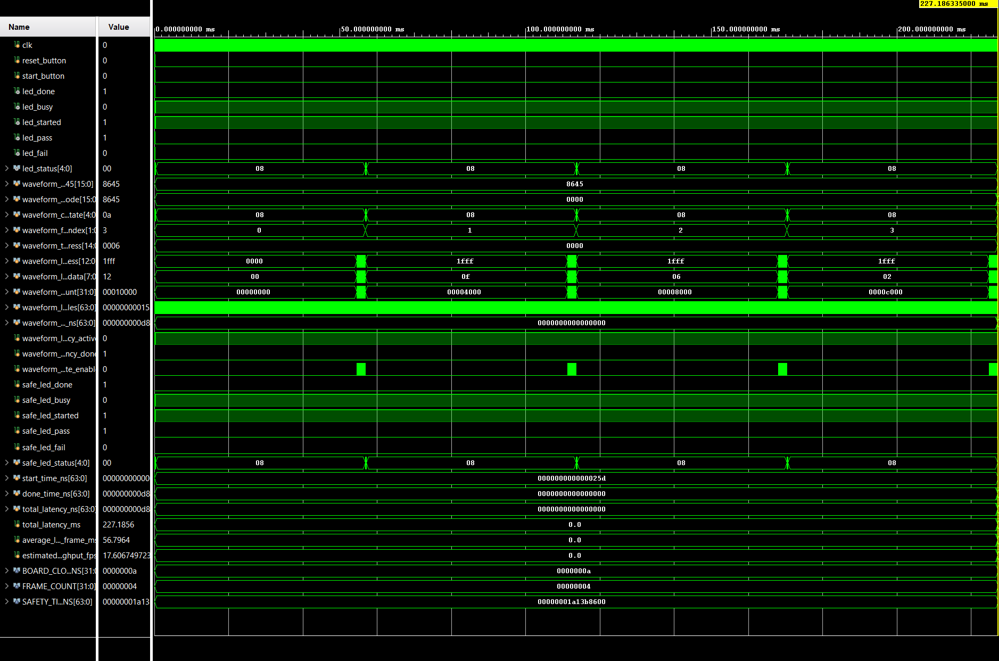

# Hybrid FPGA-CNN-GRU Perception for Autonomous Driving

This repository presents a public technical portfolio version of my ongoing MSc dissertation project on hardware-aware autonomous-driving perception using quantized CNN feature extraction, Verilog FPGA implementation, temporal feature buffering, and CNN-GRU temporal modelling.

The project investigates how a compact spatial CNN can be extended into a temporal perception pipeline while remaining compatible with FPGA deployment. Development has progressed from software CNN validation and W8A8 quantisation through Basys-3 implementation, Nexys Video scalability analysis, and FPGA-oriented architectural optimisation.

The current FPGA architecture reduces four-frame CNN feature-extraction latency from **4097.577920 ms to 227.185600 ms** at the same **50 MHz CNN core clock**, corresponding to an **18.04x architectural speedup** and approximately **94.46% latency reduction**, while preserving the complete **32,768-value W8A8 temporal feature sequence with zero mismatches**.

> **Measurement note:** FPGA latency values reported in this repository are derived from board-level RTL simulation. Physical FPGA deployment has also been demonstrated during the project, but the detailed latency figures are not direct oscilloscope, ILA, UART, or hardware-counter measurements.

---

## FPGA Platforms

The project has been implemented and evaluated using two Xilinx Artix-7 FPGA platforms:

| Platform | FPGA | Role |
|---|---|---|
| Digilent Basys-3 | XC7A35T | Original FPGA implementation and constrained-device validation |
| Digilent Nexys Video | XC7A200T | Device-scalability evaluation and higher-capacity implementation |

<p align="center">
  
  
</p>

<p align="center">
  <em>Physical FPGA validation evidence from the Basys-3 and Nexys Video implementation stages.</em>
</p>

---

## Project Status

This is an ongoing MSc dissertation project.

Completed work currently includes:

- compact CNN baseline development for binary car-presence classification
- fixed-point quantisation analysis and W8A8 selection
- FPGA-ready CNN parameter and fixed-point export
- Verilog CNN feature-extractor implementation
- exact Python-to-RTL feature verification
- four-frame temporal feature buffering
- CNN-RNN, CNN-LSTM, and CNN-GRU temporal-model comparison
- CNN-GRU selection for hybrid temporal classification
- host-side CNN-GRU validation using FPGA-compatible reconstructed features
- Basys-3 Artix-7 FPGA implementation
- physical Basys-3 validation
- controlled Basys-3 to Nexys Video FPGA port
- Nexys Video implementation and physical validation
- FPGA device-resource scalability analysis
- detailed latency bottleneck analysis
- pipelined Conv2 MAC optimisation
- four-output-channel Conv2 parallelisation
- banked Conv2 parameter memory
- four-output-channel Conv1 parallelisation
- optimized Basys-3 and Nexys Video implementation
- exact 32,768-feature optimized RTL regression
- timing closure and bitstream generation on both FPGA targets

---

## System Overview

The hybrid perception architecture combines FPGA-side spatial feature extraction with host-side temporal classification.

<p align="center">
  
</p>

<p align="center">
  <em>Hybrid architecture combining FPGA-side W8A8 CNN feature extraction and temporal buffering with host-side CNN-GRU classification.</em>
</p>

```text
Four consecutive 64 × 64 RGB frames
                |
                v
       W8A8 CNN on FPGA
                |
       Conv1 -> ReLU -> MaxPool
                |
       Conv2 -> ReLU -> MaxPool
                |
                v
       8,192 features/frame
                |
                v
     Four-frame temporal buffer
                |
                v
  32,768 signed 8-bit features
                |
                v
      Host-side reconstruction
                |
                v
          CNN-GRU classifier
                |
                v
      Car-present / no-car
```

The FPGA implementation currently covers the quantized CNN feature-extraction and temporal-buffering portion of the system. The complete CNN-GRU recurrent classifier is not currently implemented entirely in FPGA programmable logic.

---

## Architecture Diagrams

Additional architecture diagrams are available in `assets/architecture/`.

| Diagram | Purpose |
|---|---|
| [`hybrid-architecture.png`](assets/architecture/hybrid-architecture.png) | Complete hybrid FPGA-CNN-GRU processing flow |
| [`fpga-side-architecture.png`](assets/architecture/fpga-side-architecture.png) | Baseline Basys-3 FPGA-side architecture showing CNN feature extraction, temporal buffering, board controls, and status logic before later architectural optimisation |
| [`four-frame-control-flow.png`](assets/architecture/four-frame-control-flow.png) | Baseline four-frame FPGA control sequence used before the later pipelined and multi-lane architecture optimisations |
| [`host-side-classification-chain.png`](assets/architecture/host-side-classification-chain.png) | Host-side reconstruction, tensor preparation, and CNN-GRU classification |
---

# Headline Results

## Machine-Learning Results

| Result | Value |
|---|---:|
| CNN input | 64 × 64 RGB |
| CNN parameters | 1,054,050 |
| Selected quantisation | W8A8 |
| CNN features per frame | 8,192 |
| Temporal sequence | 4 frames |
| Temporal feature values | 32,768 |
| CNN-GRU test accuracy | 99.07% |
| CNN-GRU recall | 99.85% |
| CNN-GRU F1-score | 99.49% |
| CNN-GRU false negatives | 1 |
| Hybrid prediction preservation | 750 / 750 |

## Current FPGA Optimisation Results

| Metric | Result |
|---|---:|
| Original four-frame latency | 4097.577920 ms |
| Current four-frame latency | 227.185600 ms |
| Original average latency/frame | 1024.394480 ms |
| Current average latency/frame | 56.796400 ms |
| Original estimated throughput | 0.976186 fps |
| Current estimated throughput | 17.606750 fps |
| Architectural speedup | **18.04x** |
| Latency reduction | **94.46%** |
| CNN core clock | 50 MHz |
| Temporal features verified | 32,768 |
| Feature mismatches | 0 |

The 18.04x improvement was achieved **without increasing the controlled 50 MHz CNN core frequency**. The performance gain therefore comes primarily from reduced execution-cycle count through pipelining, output-channel parallelism, and memory banking.

A detailed breakdown is available in [`docs/results-summary.md`](docs/results-summary.md).

---

# CNN Baseline and Quantisation

The software CNN baseline uses the following feature-extraction path:

```text
64 × 64 RGB input
        |
        v
      Conv1
        |
       ReLU
        |
     MaxPool
        |
      Conv2
        |
       ReLU
        |
     MaxPool
        |
        v
32 × 16 × 16
        |
        v
8,192 features
```

The full software CNN also contains fully connected classification layers. For FPGA and hybrid processing, the 8,192-feature convolutional representation before those classifier layers is used.

W8A8 quantisation was selected as the FPGA implementation format.

The fixed-point workflow includes:

- activation-scale calibration
- signed 8-bit weight representation
- corrected integer bias export
- fixed-point requantisation metadata
- Python-generated reference vectors
- RTL feature-by-feature comparison

---

# Temporal Model Evaluation

Three recurrent temporal architectures were evaluated using identical four-frame CNN feature sequences.

| Model | Parameters | Test Accuracy | Recall | F1-score |
|---|---:|---:|---:|---:|
| CNN-RNN | 1,065,474 | 98.40% | 99.41% | 99.12% |
| CNN-LSTM | 4,261,122 | 99.07% | 99.56% | 99.49% |
| CNN-GRU | 3,195,906 | 99.07% | 99.85% | 99.49% |

CNN-GRU was selected because it matched CNN-LSTM test accuracy and F1-score while:

- using fewer parameters
- achieving the highest recall
- producing the lowest false-negative count

A detailed comparison is available in:

[`docs/temporal-model-comparison.md`](docs/temporal-model-comparison.md)

---

# Four-Frame FPGA Temporal Feature Extraction

Each frame produces:

```text
8,192 signed 8-bit features
```

Four consecutive frames therefore produce:

```text
4 × 8,192 = 32,768 signed 8-bit temporal feature values
```

The temporal buffer uses the following address organisation:

| Frame | Buffer Address Range |
|---|---:|
| Frame 0 | 0 to 8,191 |
| Frame 1 | 8,192 to 16,383 |
| Frame 2 | 16,384 to 24,575 |
| Frame 3 | 24,576 to 32,767 |

The complete optimized regression checks both the streamed CNN outputs and the stored temporal-buffer contents.

---

# FPGA Device Scalability

The validated temporal feature-extraction architecture was first transferred from the Basys-3 to the substantially larger Nexys Video FPGA **without changing the architecture or the 50 MHz CNN core clock**.

This controlled experiment separated FPGA capacity from FPGA architecture.

## Resource Scalability of the Unchanged Architecture

| Resource | Basys-3 | Nexys Video |
|---|---:|---:|
| Slice LUTs | 19.77% | 3.06% |
| Slice Registers | 1.89% | 0.27% |
| Block RAM | 90.00% | 12.33% |
| DSP48E1 | 8.89% | 1.08% |

The Nexys Video substantially increased implementation headroom, particularly for block RAM.

However, the unchanged architecture retained identical latency:

| Metric | Basys-3 | Nexys Video |
|---|---:|---:|
| Four-frame latency | 4097.577920 ms | 4097.577920 ms |
| Average latency/frame | 1024.394480 ms | 1024.394480 ms |
| Estimated throughput | 0.976186 fps | 0.976186 fps |

Therefore:

```text
Larger FPGA capacity alone
            !=
Lower architectural latency
```

The additional hardware resources had to be actively exploited through architectural redesign.

Full details:

[`docs/fpga-device-scalability.md`](docs/fpga-device-scalability.md)

---

# FPGA Bottleneck Analysis

Cycle-level analysis identified Conv2 as the dominant component of the original architecture.

```text
Conv2 cycles/frame ≈ 47,028,224
Conv2 latency       ≈ 940.564480 ms/frame
Share of latency    ≈ 91.82%
```

The original controller performed memory access, operand preparation, multiplication, accumulation, and output processing using a highly serial execution schedule.

The primary limitation was therefore the hardware scheduling strategy rather than insufficient FPGA capacity.

This finding motivated a sequence of FPGA-oriented architectural optimisations.

---

# FPGA Architecture Optimisation

The architecture was optimized incrementally so that every accepted change could be independently verified.

## Performance Progression

| Architecture | Four-Frame Latency | Average per Frame | Estimated Throughput | Speedup |
|---|---:|---:|---:|---:|
| Original architecture | 4097.577920 ms | 1024.394480 ms | 0.976186 fps | 1.00x |
| Pipelined Conv2 MAC | 752.128960 ms | 188.032240 ms | 5.318237 fps | 5.45x |
| Four-lane Conv2 | 449.352640 ms | 112.338160 ms | 8.901695 fps | 9.12x |
| Four-lane Conv1 + Conv2 | **227.185600 ms** | **56.796400 ms** | **17.606750 fps** | **18.04x** |

```text
Original serial architecture
        4097.577920 ms
               |
               v
      Pipelined Conv2 MAC
         752.128960 ms
               |
               v
        Four-lane Conv2
         449.352640 ms
               |
               v
  Four-lane Conv1 + Conv2
         227.185600 ms
               |
               v
        18.04x speedup
```

Detailed architecture analysis is available in:

[`docs/fpga-architecture-optimisation.md`](docs/fpga-architecture-optimisation.md)

---

## Pipelined Conv2

The first optimisation reorganised the Conv2 MAC schedule around registered arithmetic.

The goal was to reduce state-machine overhead while preserving the existing W8A8 numerical computation.

This reduced four-frame latency from:

```text
4097.577920 ms
```

to:

```text
752.128960 ms
```

for a **5.45x speedup**.

---

## Four-Lane Conv2

The next architecture processes four independent Conv2 output channels concurrently.

The design uses:

- four W8A8 multiplication lanes
- four independent accumulators
- four Conv2 weight banks
- four bias banks
- shared input-feature access

The bank mapping follows:

```text
Bank = Output Channel mod 4
```

Four-frame latency decreased further to:

```text
449.352640 ms
```

corresponding to a **9.12x speedup** over the original architecture.

---

## Four-Lane Conv1

After Conv2 acceleration, Conv1 became the principal remaining processing component.

Two-, four-, and eight-lane Conv1 architectures were analysed.

| Conv1 Parallelism | Predicted Four-Frame Latency | Predicted Throughput |
|---|---:|---:|
| 2 lanes | 301.241280 ms | 13.278393 fps |
| 4 lanes | 227.185600 ms | 17.606750 fps |
| 8 lanes | 190.157760 ms | 21.035166 fps |

Four lanes were selected as the design-space knee because the eight-lane configuration offered a smaller whole-system improvement while increasing DSP demand, routing pressure, fan-out, parameter-bank connectivity, and verification complexity.

The current Conv1 architecture broadcasts one signed 8-bit activation to four independent MAC lanes.

Each output channel still accumulates the original:

```text
3 × 3 × 3 = 27 signed products
```

in the established order.

Parallelism changes **when independent channels are calculated**, not the arithmetic sequence used to calculate an individual output value.

---

# Exact Optimized RTL Verification

Exact numerical equivalence was treated as a mandatory architectural constraint.

The optimized implementation preserves:

- signed 8-bit activations
- signed 8-bit weights
- registered signed multiplication
- original per-channel accumulation order
- signed 64-bit accumulation
- fixed-point scaling
- arithmetic shifting
- rounding behaviour
- ReLU
- saturation
- 2 × 2 maximum pooling

The complete optimized temporal regression produced:

| Verification Metric | Result |
|---|---:|
| Temporal frames captured | 4 |
| CNN features streamed | 32,768 |
| Stream address errors | 0 |
| Stream X/Z values | 0 |
| Stream mismatches | 0 |
| Temporal-buffer X/Z values | 0 |
| Temporal-buffer mismatches | 0 |
| Final regression | **PASS** |

<p align="center">
  
</p>

<p align="center">
  <em>Optimized four-frame RTL regression verifying the complete temporal CNN feature sequence.</em>
</p>

The architectural speedup was therefore achieved without changing the expected W8A8 feature results.

---

# Optimized RTL Latency Verification

The board-level latency-monitor testbench measures the top-level RTL execution interval using the external 100 MHz board clock while the CNN core operates at 50 MHz.

<p align="center">
  
</p>

<p align="center">
  <em>Board-level RTL simulation of the current optimized CNN temporal feature-extraction architecture.</em>
</p>

Current simulation-derived performance:

```text
Four-frame latency      = 227.185600 ms
Average latency/frame   = 56.796400 ms
Estimated throughput    = 17.606750 fps
Speedup vs original     = 18.04x
Latency reduction       = 94.46%
CNN core clock          = 50 MHz
```

These values are **RTL simulation measurements**, not direct physical hardware timing measurements.

---

# Optimized FPGA Resource Utilisation

The same current optimized RTL architecture was implemented for both FPGA targets.

| Resource | Basys-3 XC7A35T | Nexys Video XC7A200T |
|---|---:|---:|
| Slice LUTs | 4,876 / 20,800 = 23.44% | 4,859 / 133,800 = 3.63% |
| Slice Registers | 1,206 / 41,600 = 2.90% | 1,206 / 267,600 = 0.45% |
| Block RAM | 44.5 / 50 = 89.00% | 44.5 / 365 = 12.19% |
| DSP48E1 | 16 / 90 = 17.78% | 16 / 740 = 2.16% |

<p align="center">
  
  
</p>

<p align="center">
  <em>Final resource utilisation of the same optimized architecture on Basys-3 and Nexys Video.</em>
</p>

The larger Nexys Video provides significantly greater resource headroom, but the underlying optimized architecture remains implementable on the smaller Basys-3.

---

# Optimized Routed Timing

Both optimized FPGA implementations meet the required 50 MHz CNN core timing constraint.

| Timing Metric | Basys-3 | Nexys Video |
|---|---:|---:|
| CNN core period | 20.000 ns | 20.000 ns |
| CNN core frequency | 50 MHz | 50 MHz |
| WNS | +3.599 ns | +4.347 ns |
| TNS | 0.000 ns | 0.000 ns |
| WHS | +0.034 ns | +0.124 ns |
| THS | 0.000 ns | 0.000 ns |
| Setup failing endpoints | 0 | 0 |
| Hold failing endpoints | 0 | 0 |

<p align="center">
  
  
</p>

<p align="center">
  <em>Routed timing closure for the current optimized architecture on both FPGA platforms.</em>
</p>

Both targets successfully completed synthesis, placement, routing, design-rule checking, timing analysis, and bitstream generation.

---

# Hybrid CNN-GRU Validation

The FPGA-compatible temporal feature sequence is reconstructed on the host and supplied to the selected CNN-GRU temporal classifier.

```text
FPGA W8A8 temporal features
          |
          v
Feature reconstruction
          |
          v
[batch, 4, 8192]
          |
          v
       CNN-GRU
          |
          v
Binary temporal prediction
```

A full-test consistency experiment compared classification using floating-point CNN features with classification using quantized and reconstructed FPGA-compatible features.

| Metric | Floating-Point Features | Quantized / Reconstructed Features |
|---|---:|---:|
| Test accuracy | 98.80% | 98.80% |
| Precision | 99.56% | 99.56% |
| Recall | 99.12% | 99.12% |
| F1-score | 99.34% | 99.34% |
| Prediction preservation | - | **750 / 750** |

All 750 test predictions were preserved after feature quantisation and reconstruction.

This supports the hybrid FPGA-CNN-GRU workflow while keeping the current recurrent classifier on the host side.

---

# Repository Structure

```text
hybrid-fpga-cnn-gru-autonomous-driving/
├── README.md
├── .gitignore
│
├── python/
│   ├── cnn_baseline/
│   ├── fixed_point_quantization/
│   └── hybrid_validation/
│
├── verilog/
│   ├── rtl/
│   │   ├── baseline/
│   │   └── optimized/
│   │
│   ├── testbenches/
│   │   ├── baseline/
│   │   └── optimized/
│   │
│   ├── constraints/
│   │   ├── basys3/
│   │   └── nexys_video/
│   │
│   └── verification_data/
│       ├── parameters/
│       ├── temporal_sequence/
│       └── README.md
│
├── docs/
│   ├── dataset-and-artifact-notes.md
│   ├── temporal-model-comparison.md
│   ├── results-summary.md
│   ├── fpga-device-scalability.md
│   └── fpga-architecture-optimisation.md
│
└── assets/
    ├── architecture/
    ├── hardware_validation/
    │   ├── basys3/
    │   └── nexys_video/
    │
    └── vivado_results/
        ├── device_scalability/
        └── optimization/
```

---

# Python Components

## `python/cnn_baseline`

Selected Python files for:

- CNN baseline development
- dataset loading
- training and evaluation
- model profiling
- baseline result generation

## `python/fixed_point_quantization`

Selected files for:

- quantisation evaluation
- activation-scale calibration
- W8A8 fixed-point preparation
- corrected integer bias generation
- FPGA-compatible parameter export

## `python/hybrid_validation`

Selected files for:

- FPGA-compatible feature reconstruction
- quantisation consistency evaluation
- CNN-GRU temporal classification
- hybrid prediction-preservation analysis

---

# Verilog Components

## `verilog/rtl/baseline`

Contains the earlier validated FPGA RTL architecture used as the reference point for architectural optimisation.

## `verilog/rtl/optimized`

Contains the current optimized CNN temporal feature-extraction RTL, including:

- `cnn_feature_demo_top.v`
- `cnn_feature_extractor_bram_system.v`
- `cnn_feature_nexys_video_top.v`
- `conv1_pool_bram_system.v`
- `conv2_feature_map_controller_bram.v`
- `conv2_maxpool_controller_bram.v`
- `conv2_pixel_mac_bram.v`
- `conv2_pool_bram_core.v`
- `temporal_feature_buffer.v`

## `verilog/testbenches/baseline`

Contains the earlier functional verification environment.

## `verilog/testbenches/optimized`

Contains the current high-level regression and latency-monitor testbenches:

- `cnn_temporal_capture_tb.v`
- `cnn_board_latency_monitor_tb.v`

## `verilog/constraints`

Contains board-specific Xilinx Design Constraints for:

- Basys-3
- Nexys Video

The earlier Basys-3 top-level constraint configuration is also retained for baseline reproducibility.

---

# Reproducible FPGA Verification Data

A deliberately curated set of memory files is included under:

```text
verilog/verification_data/
```

The public verification package contains:

```text
parameters/
├── conv1_w.mem
├── conv1_b_int32_correct.mem
├── conv2_w.mem
└── conv2_b_int32_correct.mem

temporal_sequence/
├── sequence_000_frame_0_input.mem
├── sequence_000_frame_0_expected.mem
├── sequence_000_frame_1_input.mem
├── sequence_000_frame_1_expected.mem
├── sequence_000_frame_2_input.mem
├── sequence_000_frame_2_expected.mem
├── sequence_000_frame_3_input.mem
├── sequence_000_frame_3_expected.mem
└── temporal_expected_summary.txt
```

These files provide the CNN parameters and the four-frame input/reference sequence required by the optimized functional regression.

See:

[`verilog/verification_data/README.md`](verilog/verification_data/README.md)

for verification setup details.

Bulk generated vectors and dissertation data remain excluded.

---

# Key Technical Contributions

- Developed and evaluated a compact CNN for binary autonomous-driving perception.
- Evaluated fixed-point quantisation and selected W8A8 for FPGA deployment.
- Exported FPGA-compatible CNN weights, corrected biases, and scaling metadata.
- Implemented Conv1, ReLU, MaxPool, Conv2, ReLU, and MaxPool feature extraction in Verilog.
- Verified exact 8,192-feature CNN output against Python-generated reference data.
- Built a four-frame 32,768-value temporal feature buffer.
- Compared CNN-RNN, CNN-LSTM, and CNN-GRU temporal models.
- Selected CNN-GRU based on accuracy, recall, F1-score, false-negative count, and model complexity.
- Demonstrated 750 / 750 prediction preservation using FPGA-compatible reconstructed CNN features.
- Implemented and physically validated FPGA deployment stages on Basys-3 and Nexys Video.
- Demonstrated that FPGA device scaling increased resource headroom but did not reduce unchanged-architecture latency.
- Identified serial Conv2 processing as approximately 91.82% of the original frame latency.
- Redesigned Conv2 using registered pipelined MAC processing.
- Introduced four-output-channel Conv2 parallelism and banked parameter memory.
- Performed Conv1 parallelism design-space analysis.
- Introduced four-output-channel Conv1 parallelism while preserving per-channel arithmetic order.
- Reduced four-frame RTL-simulation latency by approximately 94.46%.
- Increased estimated throughput from 0.976186 fps to 17.606750 fps.
- Achieved an 18.04x architectural speedup at the same 50 MHz CNN core clock.
- Preserved all 32,768 expected temporal feature values exactly after optimisation.
- Closed routed timing and generated bitstreams on both Basys-3 and Nexys Video.

---

# Evidence Included

The repository contains selected engineering evidence rather than every development screenshot.

Included material covers:

- architecture diagrams
- FPGA processing-flow diagrams
- RTL simulation
- exact temporal regression
- board-level latency monitoring
- Vivado resource utilisation
- routed timing closure
- implemented FPGA designs
- Basys-3 physical validation
- Nexys Video physical validation

The evidence is deliberately curated to keep the repository readable while retaining the most important implementation and verification results.

---

# Dataset Note

This project uses the KITTI dataset for autonomous-driving perception experiments.

The full KITTI dataset is **not redistributed** in this repository.

Users should obtain the dataset from the official KITTI source and follow its applicable licensing and usage requirements:

https://www.cvlibs.net/datasets/kitti/

A small curated quantized temporal verification sequence is included specifically to support reproduction of the published FPGA RTL regression.

Further information is provided in:

[`docs/dataset-and-artifact-notes.md`](docs/dataset-and-artifact-notes.md)

---

# Excluded Files

The public repository intentionally excludes:

- full raw datasets
- bulk KITTI images and labels
- dataset archives
- trained model checkpoints
- `.pt`, `.pth`, `.pkl`, and similar model files
- bulk generated feature tensors
- non-curated generated memory vectors
- Vivado checkpoints
- Vivado build and cache directories
- Vivado simulation databases
- implementation run directories
- generated bitstreams
- full dissertation reports
- assessment materials
- supervisor correspondence
- large project ZIP archives

Selected `.mem` files under `verilog/verification_data/` are intentionally included because they form the curated reproducibility package for the optimized RTL regression.

---

# Tools and Technologies

- Python
- PyTorch
- NumPy
- Verilog HDL
- Xilinx Vivado
- Fixed-point arithmetic
- W8A8 quantisation
- FPGA RTL simulation
- self-checking Verilog testbenches
- BRAM-based parameter and feature storage
- DSP-based multiply-accumulate processing
- FPGA memory banking
- output-channel parallelism
- Digilent Basys-3
- Digilent Nexys Video
- Xilinx Artix-7
- CNN feature extraction
- CNN-GRU temporal modelling

---

# Technical Documentation

Detailed project summaries are available here:

- [Results Summary](docs/results-summary.md)
- [FPGA Device Scalability](docs/fpga-device-scalability.md)
- [FPGA Architecture Optimisation](docs/fpga-architecture-optimisation.md)
- [Temporal Model Comparison](docs/temporal-model-comparison.md)
- [Dataset and Artifact Notes](docs/dataset-and-artifact-notes.md)

---

# Current Limitations and Further Work

The current FPGA implementation should be interpreted within the following scope:

- reported latency is derived from board-level RTL simulation rather than direct physical timing instrumentation
- the controlled architecture comparison uses a 50 MHz CNN core clock
- maximum achievable CNN core frequency has not yet been fully explored
- the complete CNN-GRU inference pipeline is not implemented entirely in programmable logic
- deeper streaming and inter-layer overlap remain potential optimisation opportunities
- additional kernel/input-channel parallelism may provide further latency reduction
- direct hardware latency instrumentation remains future work

The current architecture therefore represents a substantial FPGA-side acceleration milestone rather than the endpoint of the optimisation process.

---

# Main Engineering Finding

The FPGA work produced a clear result:

> **Moving the unchanged CNN architecture to a larger FPGA created resource headroom, but the actual performance improvement came from redesigning the architecture to exploit that hardware through pipelining, parallel MAC execution, and memory banking.**

At the same 50 MHz CNN core frequency:

```text
Original architecture:
4097.577920 ms / four frames
0.976186 fps

Current optimized architecture:
227.185600 ms / four frames
17.606750 fps

Improvement:
18.04x speedup
94.46% latency reduction
32,768 / 32,768 features preserved exactly
```

This demonstrates the distinction between simply targeting a larger FPGA and designing an architecture that uses FPGA resources effectively.

---

## Academic Note

This repository is a public technical portfolio version of an ongoing MSc dissertation project.

It is intended to demonstrate:
- hardware-aware machine-learning development
- quantized CNN implementation
- Verilog RTL design
- self-checking hardware verification
- FPGA implementation and timing closure
- architectural bottleneck analysis
- resource-aware FPGA optimisation
- hybrid FPGA and host-side temporal inference

It is not intended to reproduce the complete dissertation submission package.