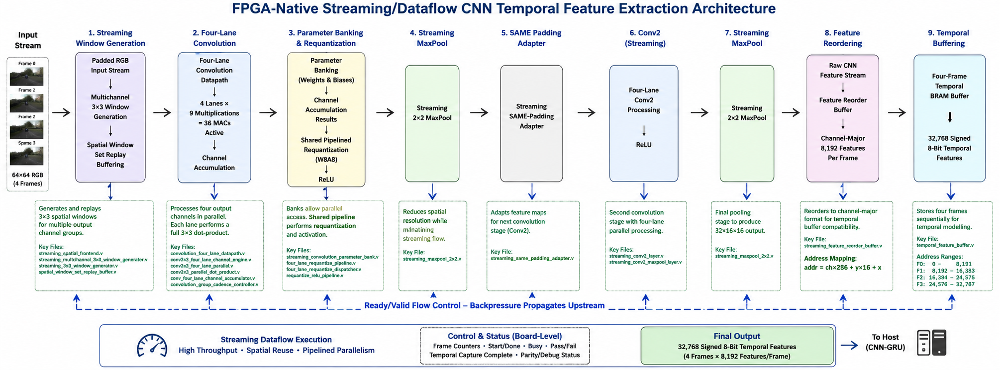

# FPGA-Native Streaming Dataflow Architecture

This document summarises the final FPGA-oriented streaming/dataflow implementation of the W8A8 CNN temporal feature-extraction system on the Digilent Nexys Video.

The architecture was developed after earlier FPGA optimisation showed that substantial speedup could be achieved without changing the CNN model or increasing the controlled 50 MHz CNN core clock. The final redesign moves away from a predominantly scheduled execution structure and instead exploits streaming data movement, concurrent processing, spatial reuse, and backpressure-aware flow control.

---

## Design Configuration

| Property | Configuration |
|---|---:|
| FPGA board | Digilent Nexys Video |
| FPGA | Xilinx Artix-7 XC7A200T |
| Device | `xc7a200tsbg484-1` |
| External board clock | 100 MHz |
| CNN core clock | 50 MHz |
| Input sequence | 4 consecutive RGB frames |
| Input resolution | 64 × 64 |
| Quantisation | W8A8 |
| CNN structure | Conv1 → ReLU → MaxPool → Conv2 → ReLU → MaxPool |
| Features per frame | 8,192 signed 8-bit values |
| Four-frame temporal features | 32,768 signed 8-bit values |
| RTL language | Verilog |

The CNN model, fixed-point representation, and output requirements remain unchanged from the previously validated implementation.

---

## Streaming Architecture

<p align="center">
  
</p>

<p align="center">
  <em>FPGA-native streaming/dataflow architecture used for the final CNN temporal feature extractor.</em>
</p>

The final processing path is organised as:

```text
Padded RGB input stream
        |
        v
Multichannel streaming 3×3 window generation
        |
        v
Spatial window-set replay buffering
        |
        v
Four-lane convolution processing
        |
        v
Channel accumulation
        |
        v
Shared pipelined requantisation
        |
        v
ReLU
        |
        v
Streaming 2×2 MaxPool
        |
        v
Streaming SAME-padding adapter
        |
        v
Four-lane Conv2 processing
        |
        v
ReLU
        |
        v
Streaming 2×2 MaxPool
        |
        v
Raw CNN feature stream
        |
        v
Feature reorder buffer
        |
        v
8,192-value channel-major frame vector
        |
        v
Four-frame temporal BRAM
        |
        v
32,768 signed 8-bit temporal features